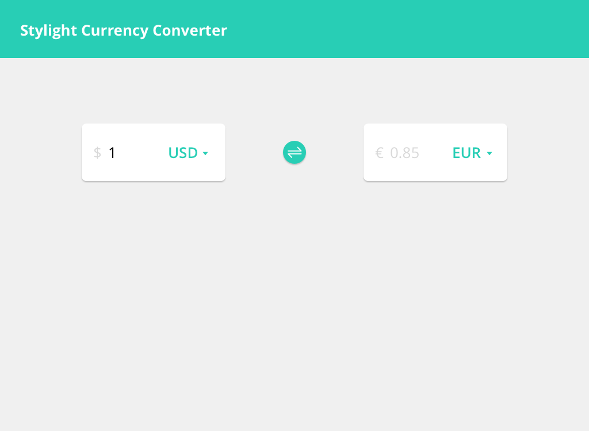

# Preview the Solution

https://rawgit.com/danielwwc/frontend-coding-challenge/master/index.html

# Frontend Developer task

- Your task is to implement a basic currency converter which converts values between Euro, US Dollar and Japanese Yen.
- The provided HTML markup is not very elaborate and just a starting point. Improve and extend it, and apply best practices.
- Do not use any post- or pre-processors for your styles, and do not use any styling libraries like Bootstrap or Foundation.
- In the JavaScript you should talk to the API endpoint for the currency conversion (use [fixer.io](http://fixer.io/) for this and make the Ajax calls with [`axios`](https://github.com/axios/axios) which is included at the bottom of the `index.html` file). Do not use any other libraries or frameworks like jQuery, Angular, React, etc.
- As the solution must only work on the latest Chrome version, you can make use of ES6 features and new CSS technologies without thinking about transpiling or vendor-prefixing things. Of course you do not have to use fancy new stuff, but it is a bonus.
- Below you find two design mock-ups for the applicaton: one for mobile resolutions and one for desktop. Match the design as close as possible.
- Further notes:
	- The application should convert the entered amount on the fly, using the conversion rates retrieved from the API.
	- By hitting the  button, the user can swap selected source and target currency. You find the sybmol used in the mockup in the `assets` folder (`switch.svg`).

### Mobile

### Desktop

